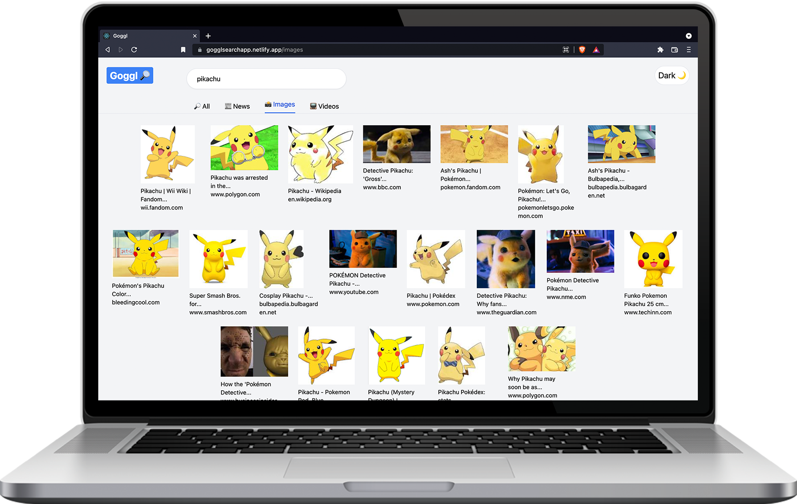

# Goggl

This Google inspired website is a search engine app. It was build with React, utilizes the Google Search API, and the design has been made mobile responsive through the use of Tailwind CSS.

## Features

- Rengineered a website with the ability to search for up-to-date results, news, images, and videos using the google search API on the Rapid API website
- Utilized the maintainability of Tailwind CSS for a modern UI, dark mode compatibility, and completely responsive design

## Author

Jason Rillera: https://github.com/JasonRillera

## [Live Demo](https://gogglsearchapp.netlify.app/)

